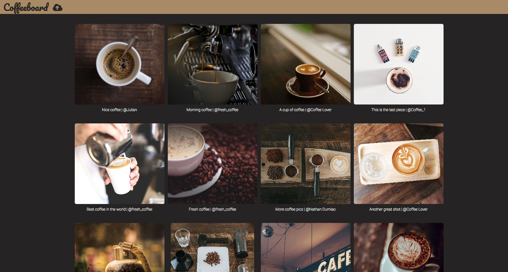
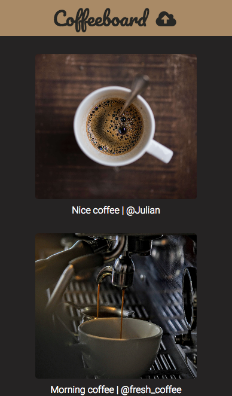
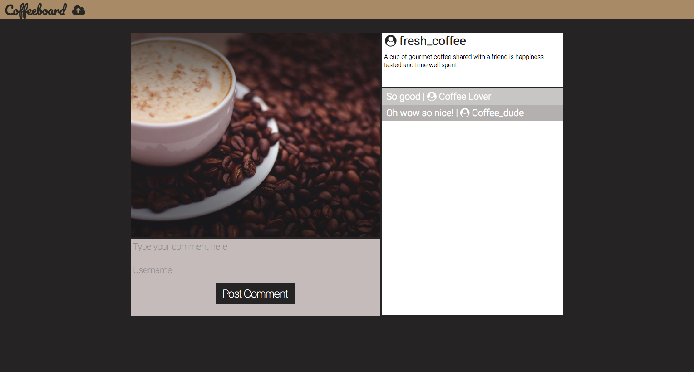
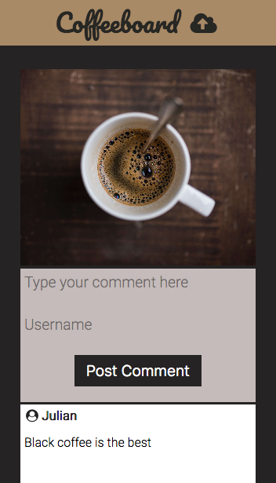
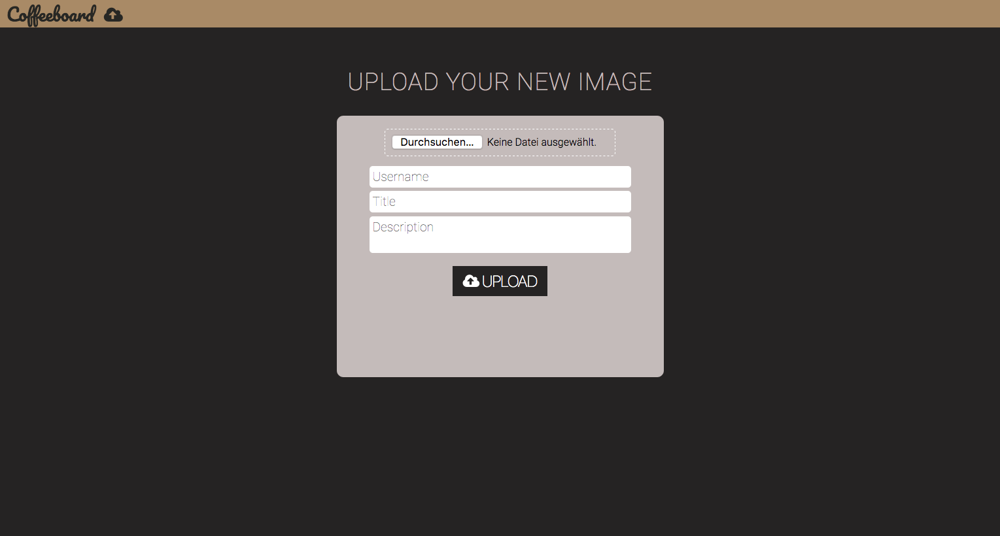
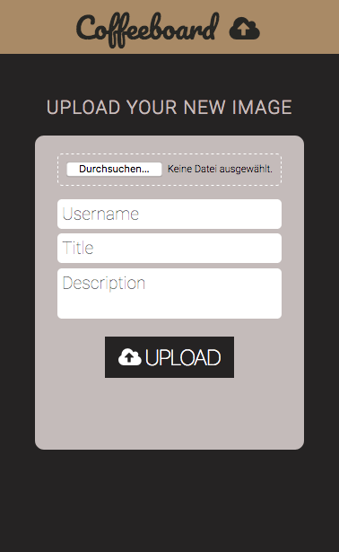

# Imageboard

## Summary
An imageboard where anybody could go and post an image of their choosing. Features include a title with a short description. People can also look at a detail view and leave comments.

## Tech Stack
* Backbone.js
* Express.js on Node.js
* PostgreSQL Database
* jQuery
* AWS S3 Cloud Storage

## Features

* The imageboard with an overview of all the images present. A 'More' button to load more pictures stored in the database.
* Users can click on an image card in the home screen and enlarge the image. There is also a comment section where users can leave a comment for others which will be stored in the database.
* The application is responsive for smartphone visitors.

